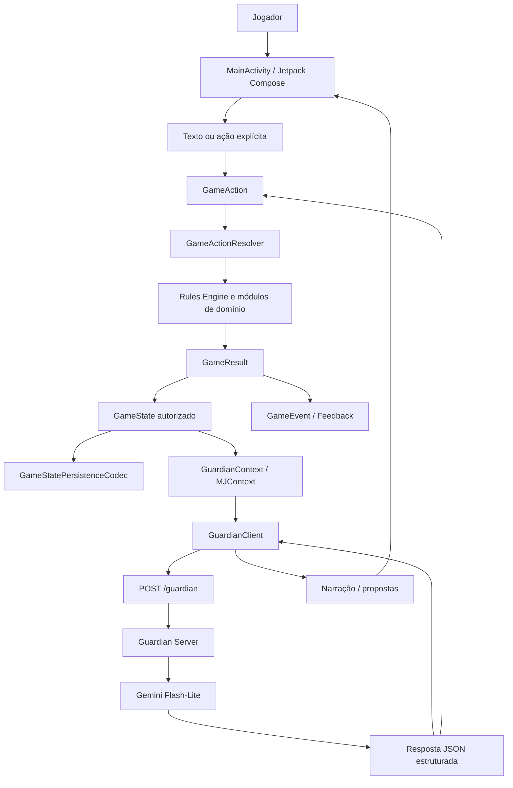

# Mapa detalhado da arquitetura

## 1. Mapa de alto nível



A seta `Response → Action` só existe para propostas validadas e convertidas em ações conhecidas. O texto do modelo nunca é aplicado diretamente ao estado.

## 2. Camadas e responsabilidades

### 2.1 Apresentação Android

**Arquivo central:** `app/src/main/kotlin/com/vanish994/cairnsolo/MainActivity.kt`

Responsabilidades:

- criar personagem;
- exibir ficha, cena e histórico;
- capturar texto do jogador;
- apresentar rolagem pendente;
- apresentar resultado mecânico;
- apresentar proposta de encontro com aceite/recusa e card de combate integrado;
- apresentar propostas de Growth após validação;
- chamar callbacks de ação, não mutar domínio.

Não deve conter:

- cálculo de dano;
- alteração direta de HP ou inventário;
- decisão de sucesso/falha;
- interpretação de regra do Cairn;
- chamada direta ao `RulesEngine`.

### 2.2 Contrato de ações

**Arquivo:** `game/GameAction.kt`

`GameAction` é a porta de entrada das mutações. Categorias atuais incluem:

- criação de personagem;
- exploração e descanso;
- intenção do Guardian/jogador;
- dano, itens, Fadiga, privação e saves;
- estabilização e recuperação de cicatriz;
- proposta/início e ataque de combate; `EndCombat` não encerra combate ativo sem procedimento autorizado;
- magia;
- marketplace;
- downtime;
- viagem, wilderness, clima e dungeon;
- reações, moral, hirelings;
- Growth e atualizações de cânone.

O próximo trabalho deve verificar se cada ação está coberta por teste de resolver e persistência.

### 2.3 GameActionResolver

**Arquivo:** `game/GameAction.kt`

Responsabilidades:

1. receber `GameState` + `GameAction`;
2. validar pré-condições de campanha;
3. chamar o módulo de domínio correto;
4. converter `RuleEvent` em `GameEvent`;
5. produzir `GameResult`;
6. anexar histórico quando a regra representa uma mudança relevante;
7. avançar turno somente no lugar definido pelo contrato.

Regra de manutenção: se uma nova mutação for adicionada a outro lugar, ela deve ser removida desse caminho paralelo e centralizada aqui.

### 2.4 Domínio de regras

| Módulo | Responsabilidade | Integração esperada |
|---|---|---|
| `RulesEngine.kt` | atributos, saves, HP, Armor, inventário, Fadiga, privação, dano, Scars, recuperação | usado pelo resolver e por módulos específicos |
| `CharacterGenerator.kt` | rolagens de criação, backgrounds, traits e idade | cria estado inicial válido |
| `CombatRules.kt` | iniciativa, ataques, dano e rodadas | `BeginCombat`, `CombatAttack`; o resolver bloqueia `EndCombat` enquanto o combate estiver ativo |
| `DungeonRules.kt` | turnos e procedimentos de dungeon | `DungeonAct` |
| `WildernessRules.kt` | viagem, watches, clima e acampamento | `StartTravel`, `WildernessAct`, `RollWeather` |
| `MagicRules.kt` | magia, spellbooks, custo e falha | `CastSpell` |
| `Marketplace.kt` | catálogo, compra, ouro e inventário | `Purchase` |
| `DowntimeRules.kt` | atividades e recuperação entre aventuras | `PerformDowntime` |
| `WardenRules.kt` | reações, moral, hirelings e procedimentos do Warden | ações de reação/moral/hireling |

Todos os módulos devem ser independentes de Android, Compose, HTTP e Gemini.

## 3. Modelo de estado

### 3.1 GameState e CampaignState

**Arquivos:** `game/GameState.kt`, `game/CampaignRuntime.kt`

O estado da campanha deve conter, direta ou indiretamente:

```text
identidade da campanha
campaignSeed
personagem e CharacterState
profile/equipamento inicial
cena atual e tipo de cena
turno
exits
mundo gerado
wilderness/dungeon ativos
combate ativo
hirelings
factions
quests
Growth/evidências/propostas
WorldCanon
CampaignHistory
guardianHistory e log
última interação do Guardian
```

Ponto de atenção: `CampaignState` e `CampaignRuntime` possuem conceitos sobrepostos. Antes de expandir os dois, decidir qual é o modelo persistível oficial e registrar a decisão em ADR.

### 3.2 Mudança de estado

```text
estado anterior
    + ação
    + RNG controlado
    ↓
resultado de domínio
    ├── estado posterior
    └── eventos
```

O resultado deve ser reproduzível quando a fonte de aleatoriedade do teste for fixa.

### 3.3 Histórico e cânone

- **Narrativa:** pode ser reescrita ou resumida.
- **Histórico de campanha:** registra fatos relevantes e eventos mecânicos.
- **Cânone:** registra fatos confirmados do mundo.
- **Proposta:** ainda não é fato; aguarda validação.
- **Growth evidence:** evidência ficcional registrada, não avanço automático.
- **Growth change:** mudança validada pelo domínio, ainda dependente da decisão prevista pelo produto/jogador.

Nunca colapsar esses níveis em uma única string narrativa.

## 4. Fluxo de uma ação do jogador

### 4.1 Ação mecânica explícita

Exemplo: o jogador solicita descanso.

```text
Toque em “Descanso seguro”
    ↓
GameAction.ExploreRest
    ↓
GameActionResolver.resolveRest
    ↓
RulesEngine.safeRest
    ↓
GameResult
    ├── HP/Fadiga atualizados
    └── RestCompleted
    ↓
GameState.withRules
    ↓
FeedbackMapper
    ↓
UI atualiza ficha e histórico
```

A regra atual trata `safeRest` como um descanso seguro e não como avanço narrativo. O contexto de segurança do local ainda precisa ser modelado explicitamente para separar acampamento, dungeon e abrigo.

### 4.2 Ação em linguagem natural

```text
Jogador digita intenção
    ↓
GuardianIntent / GuardianClient
    ↓
GuardianContext filtrado
    ↓
Backend /guardian
    ↓
JSON de narrativa + ruleRequest/canonProposals/growthProposals
    ↓
validação do contrato
    ↓
se ruleRequest: resolver regra deterministicamente
se canon proposal: CanonResolver valida
se growth proposal: Growth valida evidências e mudança
se narrativa: registrar histórico visual
    ↓
Guardian narra resultado autorizado
```

A intenção “ataco o goblin” não deve permitir que o modelo informe “você causou 6 de dano”. Ela deve gerar uma solicitação para o fluxo de combate, que então chama `CombatRules`.

## 5. Fluxo de combate desejado

```text
cena de exploração
    ↓
Guardian detecta/propõe encontro
    ↓
GameAction.BeginCombat
    ↓
CombatState criado pelo domínio
    ↓
UI entra em modo de combate
    ↓
GameAction.CombatAttack
    ↓
CombatRules resolve ataque e contra-ataque
    ↓
DamageResolved / Critical / Scar / Morale events
    ↓
Guardian recebe resultado e narra
    ↓
se a resolução autoritativa termina em vitória/morte: CombatEnded
se personagem morre: estado terminal
se combate continua: próxima intenção/ação de combate
```

**Implementado no PR #16:** o Guardian retorna `BEGIN_COMBAT` como proposta; a UI exige aceite/recusa; `GameActionResolver` valida armas e controla iniciativa/ataques; o Guardian recebe somente resumo derivado dos eventos para narrar. A arma do jogador é reconstruída do inventário, o resultado não é escolhido pelo modelo e o save preserva o perfil do oponente.

**Limites atuais:** o fluxo cobre um oponente por estado de combate e não oferece fuga/encerramento voluntário; `EndCombat` é rejeitado durante combate ativo. Não inventar essa regra na UI até definir um procedimento normativo. A validação visual em dispositivo real permanece pendente.

Invariantes:

- não iniciar segundo combate enquanto `campaign.combat != null`;
- não permitir ações de exploração durante combate;
- não permitir o Guardian escolher o dano;
- todos os participantes e armas devem existir no estado ou no payload validado;
- ataque, Armor, HP, Critical Damage e Scars devem sair do domínio;
- moral e fuga devem gerar eventos verificáveis.

## 6. Fluxo de Growth

```text
ação relevante da campanha
    ↓
Growth trigger
    ↓
evidência registrada
    ↓
Guardian pode sugerir growth proposal
    ↓
Growth domain valida:
    - evidências existentes
    - gatilhos permitidos
    - mudança válida
    - duplicação/conflito
    ↓
proposta pendente
    ↓
jogador aceita ou recusa
    ↓
GameAction.ApplyGrowth / decisão equivalente
    ↓
CharacterState + histórico + Guardian Context atualizados
```

A narração não pode dizer que o personagem ganhou uma habilidade antes da aplicação autorizada.

## 7. Fluxo de cânone do mundo

```text
Guardian observa ou propõe fato
    ↓
CanonProposal
    ↓
CanonResolver
    ├── conflito com fato confirmado?
    ├── origem válida?
    ├── escopo da campanha?
    └── proposta duplicada?
    ↓
WorldCanon atualizado
    ↓
CampaignHistory atualizado
    ↓
próximo GuardianContext recebe somente fatos confirmados
```

Detalhes puramente narrativos podem permanecer no histórico sem virar cânone.

## 8. Persistência e recuperação

**Arquivos:**

- `game/GameStatePersistenceCodec.kt`;
- `game/GameStateRepository.kt`;
- `game/WorldStatePersistenceCodec.kt`.

Checklist para cada campo novo:

1. serializar;
2. desserializar;
3. fornecer default/migração para saves antigos;
4. comparar igualdade no round-trip;
5. testar listas vazias, nulos e estados ativos;
6. incluir combate, dungeon, wilderness, Growth, cânone e histórico;
7. verificar que o Guardian não recupera contexto bruto por acidente.

## 9. Guardian e backend

### Android

| Arquivo | Papel |
|---|---|
| `guardian/GuardianContext.kt` | DTO controlado da visão entregue ao modelo |
| `game/MJContext.kt` | montagem de contexto adicional da campanha |
| `guardian/GuardianClient.kt` | chamada HTTP e contrato de resposta |
| `guardian/GuardianRuleResolver.kt` | coordenação de solicitações de regra |

### Backend

| Arquivo | Papel |
|---|---|
| `guardian-server/.../Server.kt` | endpoint HTTP, schema, prompt, Gemini e resposta |
| `guardian-server/scripts/integration-test.sh` | teste do endpoint implantado |

O backend deve permanecer stateless quanto à autoridade do jogo: recebe contexto autorizado, retorna proposta/narração estruturada e não é a fonte definitiva de estado.

## 10. Testes por camada

| Camada | Teste principal |
|---|---|
| Rules Engine | `RulesEngineTest`, `CombatRulesTest`, `MagicRulesTest` |
| Wilderness/Dungeon | `WildernessRulesTest`, `DungeonRulesTest` |
| Warden | `WardenRulesTest` |
| Ações integradas | `GameActionResolverTest` |
| Estado | `GameStateTest`, `WorldIntegrationTest` |
| Growth/cânone | `GrowthTest`, `CanonResolverTest` |
| Guardian Context | `GuardianContextTest` |
| Feedback | `FeedbackMapperTest` |
| Backend | testes em `guardian-server/src/test` + script HTTP |

Para toda nova regra, escrever primeiro o caso determinístico do domínio e depois o caso de integração através de `GameActionResolver`.

## 11. Mapa de dependências permitido

```text
ui
 └── pode conhecer GameAction, GameState e contratos de apresentação

game
 ├── pode conhecer rules
 ├── pode conhecer contratos do Guardian
 └── não deve depender de Compose

rules
 ├── pode conhecer modelos puros e RNG
 └── não pode depender de Android, HTTP ou Gemini

guardian client/context
 ├── pode conhecer DTOs e transporte
 └── não pode aplicar mutação mecânica

backend
 ├── pode conhecer prompt, schema e Gemini
 └── não substitui o Rules Engine local
```

Se surgir uma dependência contrária, prefira mover a transformação para um adapter/mapper em vez de criar uma exceção.

## 12. Mapa dos próximos marcos

```text
M1: documentação e estado real sincronizados
  ↓
M2: GameActionResolver cobre todas as mutações
  ↓
M3: save/load completo e versionado
  ↓
M4: combate conectado ao Guardian e à UI
  ↓
M5: Growth/cânone com revisão do jogador
  ↓
M6: E2E campanha completa
  ↓
M7: release APK e teste em dispositivo real
```

Cada marco precisa de:

- código;
- testes determinísticos;
- teste de integração quando houver rede;
- atualização de status;
- CI verde;
- documentação do comportamento e das limitações.
